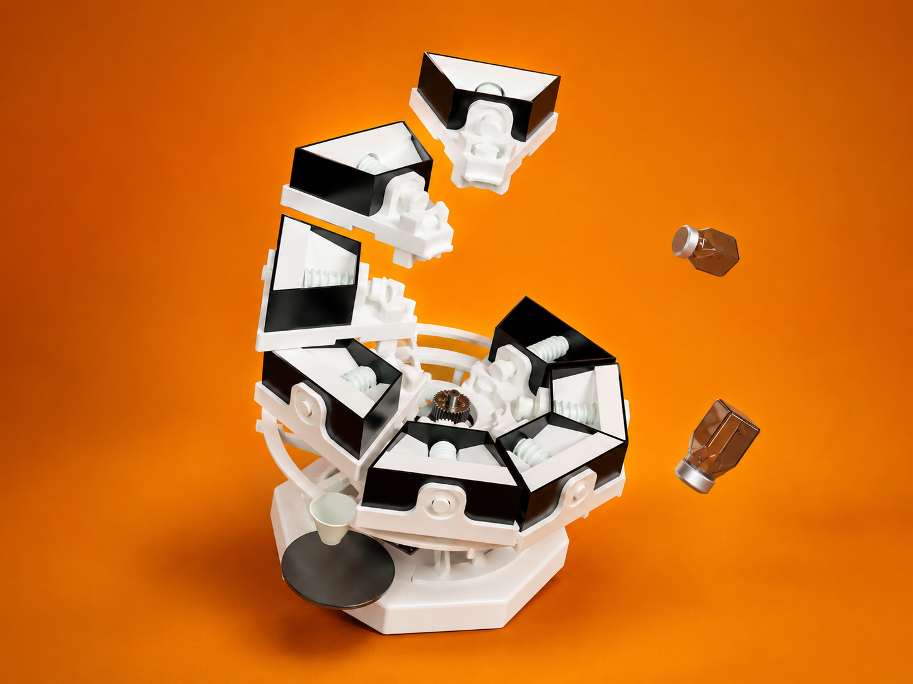

<div align="center">
  
# Bland2Grand



### Automatic AI‑Powered Spice Dispensing System

**Arduino UNO R4 WiFi • Flask • React • Load Cell Feedback • Custom Recipe Generation**

Search for a recipe (or build your own blend), choose the number of servings, and Bland2Grand automatically dispenses each spice with real-time weight feedback.

</div>

---

## Features

- 8-slot automatic spice carousel
- Weight-based dispensing with HX711 load cell
- React touchscreen kiosk interface
- Flask orchestration backend
- Arduino firmware controlling motors and sensors
- AI-assisted custom spice blend generation
- Live dispense updates using Server-Sent Events

---

## System Architecture

```text
Phone / Browser
      │
      ▼
React UI (5173)
      │
 REST + SSE
      │
      ▼
Flask Backend (5000)
      │
 HTTP + UDP
      │
      ▼
Arduino UNO R4 WiFi
      │
 GPIO
      │
      ▼
Carousel • Auger • Load Cell
```

The frontend never communicates directly with the Arduino. Flask coordinates every dispense operation, receives progress updates from the Arduino, and streams them to connected clients using Server-Sent Events.

---

## Engineering Journals

Development was documented weekly throughout the project.

| Week | Journal |
|------|---------|
|1|https://lying-denim-736.notion.site/Journal-1-33765230a78b8010af24f441907a132c?pvs=73|
|2|https://lying-denim-736.notion.site/Journal-2-33765230a78b808d91aac0a6b3ddb459?pvs=73|
|3|https://lying-denim-736.notion.site/Journal-3-33765230a78b80e9b983e4aa1db35312?pvs=4|
|4|https://lying-denim-736.notion.site/Journal-4-33765230a78b8081bd38f594ebceb503?pvs=73|
|5|https://lying-denim-736.notion.site/Journal-5-33765230a78b80ebb033f5e4358f1c1f|
|6|https://lying-denim-736.notion.site/Journal-6-33765230a78b804fb087c1ad0b55b3ff?source=copy_link|
|7|https://lying-denim-736.notion.site/Journal-7-33765230a78b80bd848ce638972f48d1?pvs=74|
|8|https://lying-denim-736.notion.site/Journal-8-33765230a78b806ebfbeec2ee93a6579?pvs=74|
|9|https://lying-denim-736.notion.site/Journal-9-33765230a78b80528cf1d645e4d33567?pvs=74|
|10|https://lying-denim-736.notion.site/Journal-10-34865230a78b807989e8eb5f8e950e21?pvs=74|

---

## Design Documentation

| Document | Description | File |
|----------|-------------|------|
| **HRS**  | Hardware Requirements Specification | [docs/HRS.pdf](docs/HRS.pdf) |
| **PDD**  | Preliminary Design Document | [docs/PDD.pdf](docs/PDD.pdf) |
| **HDD**  | Hardware Design Document | [docs/HDD.pdf](docs/HDD.pdf) |

---

## Quick Start

1. Enable the **bland2grand** Windows hotspot.
2. Power the Arduino UNO R4 WiFi.
3. Run the **Bland2Grand: Full Stack** VS Code task.
4. Forward port **5173** and set visibility to **Public**.
5. Open the forwarded URL on your phone or `http://localhost:5173` on your PC.

---

## Repository Structure

```text
Bland2Grand/
├── Bland2Grand_Arduino/
├── bland2grand-backend/
├── bland2grand-frontend/
├── docs/
├── generate_slots.py
└── .vscode/
```

---

## Updating Spice Slots

Edit `spice_slots.json`, keep slot numbers sequential, then regenerate shared configuration:

```bash
python generate_slots.py
```

---

## First-Time Development Setup

### Backend

```bash
cd bland2grand-backend
python -m venv venv
venv\Scripts\activate
pip install -r requirements.txt
python seed_recipes.py
```

Create `.env`:

```env
ARDUINO_URL=http://192.168.137.50
OPENROUTER_API_KEY=...
AI_MODEL=anthropic/claude-3-haiku
DATABASE_PATH=bland2grand.db
FLASK_PORT=5000
MOCK_ARDUINO=true
```

### Frontend

```bash
cd bland2grand-frontend
npm install
```

### Arduino

Open `Bland2Grand_Arduino` using PlatformIO and upload the firmware.

---

## Hardware

| Component | Purpose |
|-----------|----------|
|Arduino UNO R4 WiFi|Main controller|
|NEMA 23 + TB6600|Carousel motor|
|NEMA 17 + TB6600|Auger motor|
|HX711 + Load Cell|Weight feedback|

### Pinout

| Signal | Pin |
|---------|-----|
|Carousel STEP|D5|
|Carousel DIR|D7|
|Auger STEP|D3|
|Auger DIR|D4|
|HX711 SCK|A0|
|HX711 DOUT|A1|

---

## Troubleshooting

| Problem | Solution |
|---------|----------|
|Arduino won't connect|Verify hotspot credentials in `main.cpp`.|
|UI loads but dispense fails|Check Flask and Arduino IP configuration.|
|Phone can't access app|Make sure port 5173 is Public.|
|Serial monitor unavailable|Close Arduino IDE or other serial applications.|

